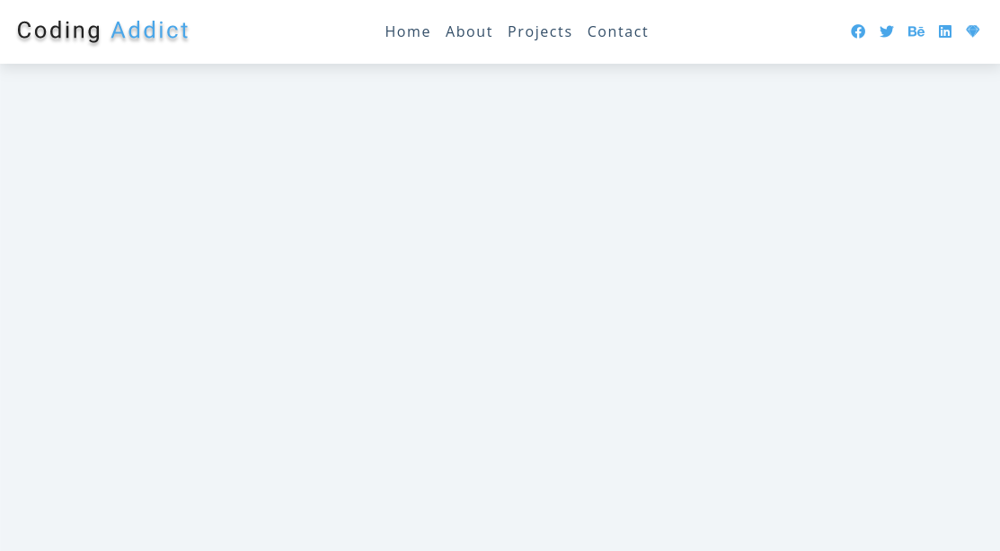
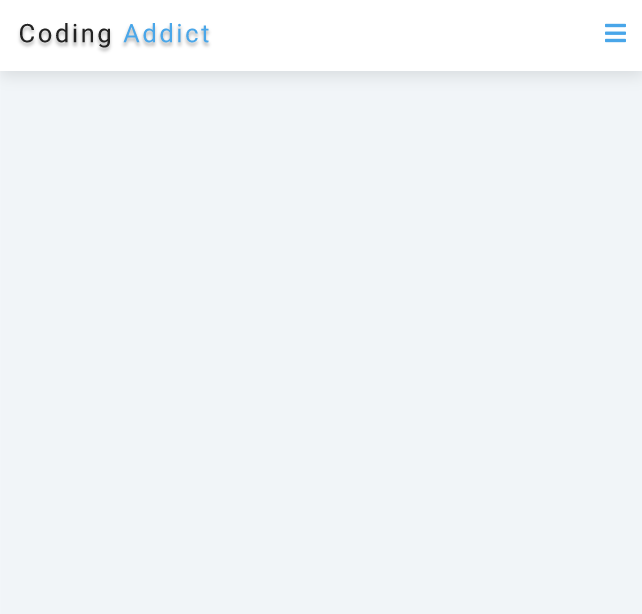
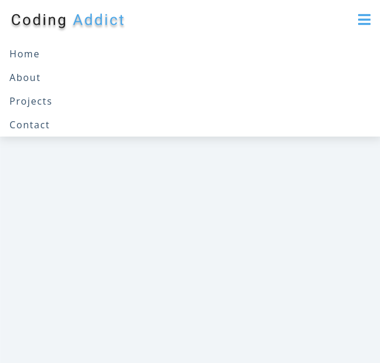

## Welcome! 👋

Thanks for checking out this project.

In this project I created a responsive navbar that opens when you click on the hamberger menu and you can close it if you want to you. It's very important to know how to do this so I'm glad I learned this.