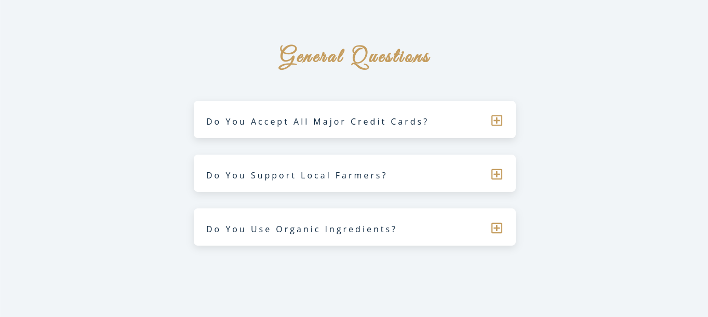

## Welcome! 👋

Thanks for checking out this project.

This is was an easy project to work on. I added a pretty nice animation when you hover over the plus icon and when you click on the plus icon it displays the answer to the question. You can close the answer when the minus icon shows up. If you want to see how it works you can upload the code to your code editor. Thanks for taking a look at this project. 