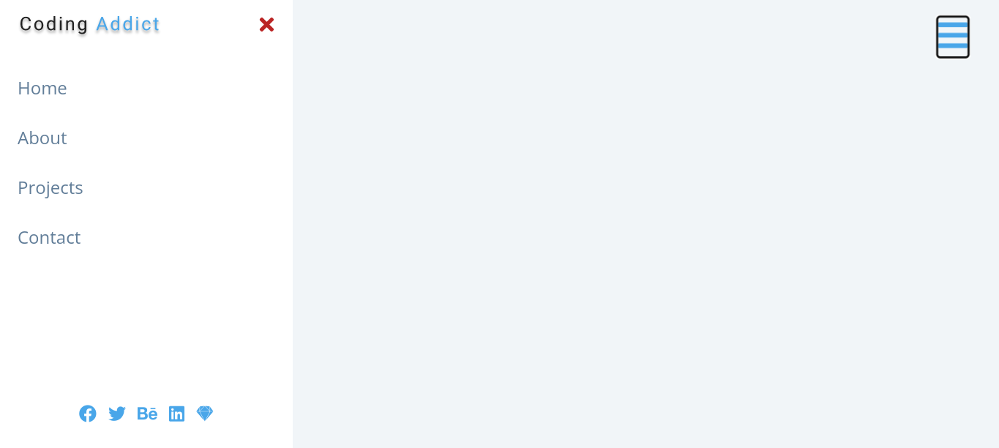

## Welcome! 👋

Thanks for checking out this project.

Here I'm building a sidebar with a hamberger menu that you can click on that opens the sidebar and you can click on the "X" button to close the sidebar. This is something else I learned how to do. Thank you for taking a look at this project. 